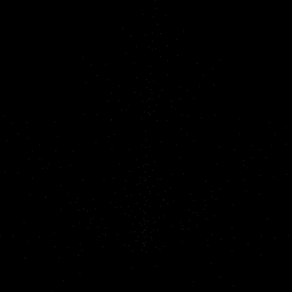

# Fractal Generator

This is some code to build fractals using iterated function systems.


## Usage

```
go_fractals ifs --help
Pass in a file that contains an iterated function system

Usage:
  go_fractals ifs [flags]

Flags:
      --algo-d                       [OPTIONAL] Use the deterministic algorithm (default true)
      --algo-p                       [OPTIONAL] Use the probabilistic algorithm
  -f, --fps int                      [OPTIONAL] The framerate of the video. (default 10)
  -h, --help                         help for ifs
  -n, --numItr int                   [OPTIONAL] The number of iterations you want to use. (default 1)
  -z, --numPoints int                [OPTIONAL] The number of initial points. (default 1)
  -k, --numStacks int                [OPTIONAL] The number of stacks to generate (default 1)
  -t, --numTransforms int            [OPTIONAL] The number of transforms to randomly generate. (default 2)
  -p, --path string                  [REQUIRED] The path to your iterated function system file
      --probabilities float64Slice   [OPTIONAL - comma separated] Specify probabilities of transformations. Must add to 1. If none will calculated based on matrices. Note that a determinant of zero can cause unexpected things. (default [])
  -r, --random                       [OPTIONAL] Create a random 2D Iterated Function system using the probabilistic algorithm
  -s, --stack                        [OPTIONAL] Generate the corresponding fractal stack - writes to ~/Downloads/out.stl file
  -T, --thickness float32            [OPTIONAL] Specify the thickness the stack layer (default 15)
  -v, --video                        [OPTIONAL] Whether to create a video or not
```

## Building Fractals with Iterated Function Systems

The CLI tool revolves around the user generated file (you can call it whatever you like when you pass it into the CLI).

Here's what a sample file, `ifs.txt`, looks like:
```
[2,2][.5,0,0,.5] + [2,1][0,0]
[2,2][-.5,0,0,.5] + [2,1][1,0]
[2,2][.5,0,0,-.5] + [2,1][0,1]
[2,2][.25,0,0,.25] + [2,1][.75,.75]
```

Each newline represents a new transformation in the system. Information about the transformation is encoded in the following way:

```
[2,2][.5,0,0,.5] + [2,1][0,0] ->
[number_of_rows, number_of_columns][similiarity_matrix] + [number_of_rows, number_of_columns][shift_matrix]
```

So, if we look at `[2,2][.5,0,0,.5], we see this is a 2x2 matrix.` When ordering elements of the matrix, start in the first row, and go across columns, then go tho the second row and so on.

So the the identity matrix:
```
[ 1 0 ]
[ 0 1 ]
```

Is represented as `[2,2][1,0,0,1]`.

Note that shifts should always have a `number_of_columns = 1`, since you are simply moving the points.

## Example

Here are several ways to generate the barnsley fern which is represented by the following IFS:

```
[2,2][0,0,0,.16] + [2,1][0,0]
[2,2][.85,0.04,-.04,.85] + [2,1][0,1.6]
[2,2][0.2,-.26,.23,.22] + [2,1][0,1.6]
[2,2][-.15,.28,.26,.24] + [2,1][0,.44]
```

The deterministic algorithm:
1) `go_fractals ifs -p examples/barnsley_fern_ifs.txt --algo-d -n 13`

The probabilistic algorithm:

2) `go_fractals ifs -p examples/barnsley_fern_ifs.txt --algo-p -n 67108864`

The probabilistic algorithm with custom probabilities for each transformation (This will do a better job of adding the stem compared to the probabilistic algorithm alone):

3) `go_fractals ifs -p examples/barnsley_fern_ifs.txt --algo-p -n 67108864 --probabilities .1,.67,.115,.115`

And here it is:


## .stl files:

### Stacks

Stacks are a pain to do properly, and I currently do not have the 3D skills to properly do them.
Right now what the "stacks" are, are a set of 2-D points (the fractal) and an identical set of points shifted into 3-D space.
Then we just connect the corresponding points.

This way of doing things is not feasible for 3-D printing because we're not actually creating surfaces, just a whole bunch of parallel lines organized in a way that makes the fractal look 3-D. The printers aren't smart enough to know the thing is a very good approximation of a 3D object.

Here's an example of a .stl produced by the stack maker:


## Videos

You can also generate videos of fractals developing:


## Random Fractals

This did not work out the way I expected and need refinement. Currently, you rarely get anything interesting.
Most of the time they aren't fractals in the rigorous sense.


## A full suite - The maple fractal:
```
[2,2][.15,0,0,.5] + [2,1][-.125,-1]
[2,2][.4,.4,-.5,.5] + [2,1][1.2,-.75]
[2,2][.4,-.4,.5,.5] + [2,1][-1.4,-.73]
[2,2][.5,0,0,.5] + [2,1][.01,1.5]
```

### Deterministic
```
$ go_fractals ifs -p maple.ifs --algo-d -n 11
Total number of points: 4194304
Elapsed time for Deterministic algorithm: 1.121766417s
```


### Probabilistic
(using same # of points as deterministic, hence: `-n 4194304`)
```
$go_fractals ifs -p leaf.ifs --algo-p -n 4194304
probabilities: [0.06666666666666667 0.35555555555555557 0.35555555555555557 0.2222222222222222]
Total number of points: 4194305
Elapsed time for Probabilistic algorithm: 8.189872041s
```


### Video
```
go_fractals ifs -p leaf.ifs --algo-d -v -n 11 --fps 3
```


### Stack
```
go_fractals ifs -p leaf.ifs --stack -k 1 -T 50 -n 1000000 --algo-p
```
