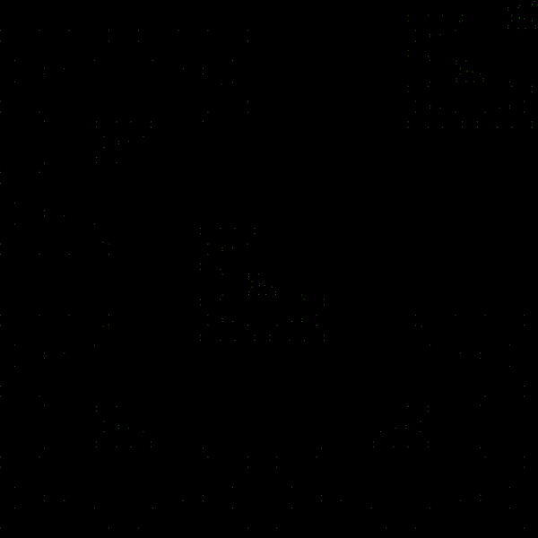
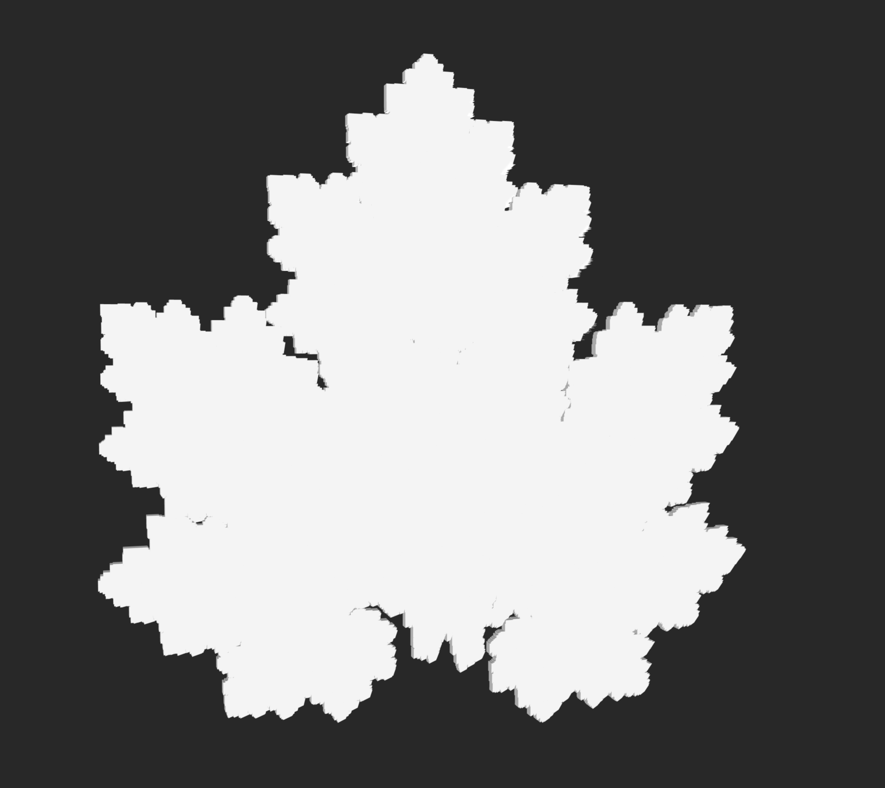
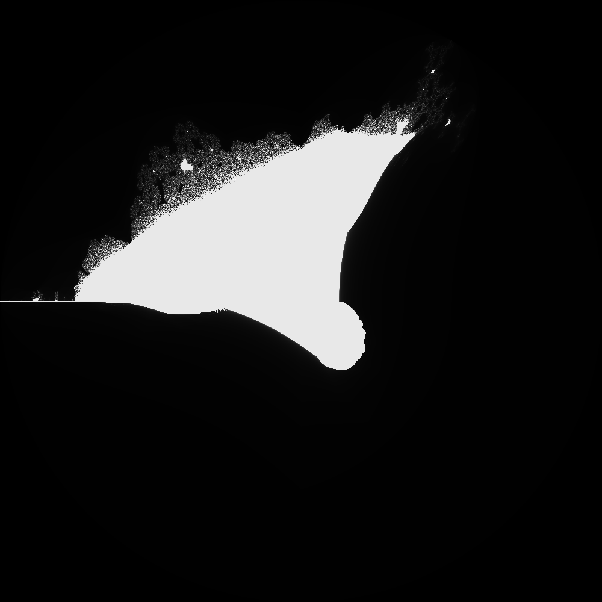

# Fractal Generator


Build fractals with a cli:
```
$ go_fractals --help
A Command Line Application to build fractals in Go.

Usage:
  go_fractals [command]

Available Commands:
  completion   Generate the autocompletion script for the specified shell
  help         Help about any command
  ifs          Access Iterated function system commands
  julia        create a julia set
  julia-evolve evolve a julia set through a parameter
  mandelbrot   create a mandelbrot set

Flags:
  -F, --fileName string   [OPTIONAL] Set file name (default "fractalOutput")
  -f, --fps int           [OPTIONAL] The framerate of the video. (default 10)
  -H, --height int        [OPTIONAL] Set height (default 1000)
  -h, --help              help for go_fractals
  -W, --width int         [OPTIONAL] Set width (default 1000)

Use "go_fractals [command] --help" for more information about a command.
```

# Iterated Function Systems

## Usage

```
$ go_fractals ifs --help
Access Iterated function system commands

Usage:
  go_fractals ifs [command]

Available Commands:
  evolve      iterate through an ifs
  image       Run an iterated function system

Flags:
      --algo-d                       [OPTIONAL] Use the deterministic algorithm (default true)
      --algo-p                       [OPTIONAL] Use the probabilistic algorithm
  -h, --help                         help for ifs
  -n, --numItr int                   [OPTIONAL] The number of iterations you want to use. (default 1)
  -z, --numPoints int                [OPTIONAL] The number of initial points. (default 1)
  -k, --numStacks int                [OPTIONAL] The number of stacks to generate (default 1)
  -p, --path string                  [REQUIRED] The path to your iterated function system file
      --probabilities float64Slice   [OPTIONAL - comma separated] Specify probabilities of transformations. Must add to 1. If none will calculated based on matrices. Note that a determinant of zero can cause unexpected things. (default [])
  -T, --thickness float32            [OPTIONAL] Specify the thickness the stack layer (default 15)

Global Flags:
  -F, --fileName string   [OPTIONAL] Set file name (default "fractalOutput")
  -f, --fps int           [OPTIONAL] The framerate of the video. (default 10)
  -H, --height int        [OPTIONAL] Set height (default 1000)
  -W, --width int         [OPTIONAL] Set width (default 1000)

Use "go_fractals ifs [command] --help" for more information about a command.
```

## Building Fractals with Iterated Function Systems

The CLI tool revolves around the user generated file (you can call it whatever you like when you pass it into the CLI).

Here's what a sample file, `ifs.txt`, looks like:
```
[2,2][.5,0,0,.5] + [2,1][0,0]
[2,2][-.5,0,0,.5] + [2,1][1,0]
[2,2][.5,0,0,-.5] + [2,1][0,1]
[2,2][.25,0,0,.25] + [2,1][.75,.75]
```

Each newline represents a new transformation in the system. Information about the transformation is encoded in the following way:

```
[2,2][.5,0,0,.5] + [2,1][0,0] ->
[number_of_rows, number_of_columns][similiarity_matrix] + [number_of_rows, number_of_columns][shift_matrix]
```

So, if we look at `[2,2][.5,0,0,.5], we see this is a 2x2 matrix.` When ordering elements of the matrix, start in the first row, and go across columns, then go tho the second row and so on.

So the identity matrix is:
```
[ 1 0 ]
[ 0 1 ]
```

Is represented as `[2,2][1,0,0,1]`.

Note that shifts should always have a `number_of_columns = 1`, since you are simply moving the points.

## Example

Here are several ways to generate the Barnsley fern which is represented by the following IFS:

```
[2,2][0,0,0,.16] + [2,1][0,0]
[2,2][.85,0.04,-.04,.85] + [2,1][0,1.6]
[2,2][0.2,-.26,.23,.22] + [2,1][0,1.6]
[2,2][-.15,.28,.26,.24] + [2,1][0,.44]
```

The deterministic algorithm:
1) `$ go_fractals ifs image -p examples/barnsley_fern_ifs.txt --algo-d -n 13`

The probabilistic algorithm:

2) `$ go_fractals ifs image -p examples/barnsley_fern_ifs.txt --algo-p -n 67108864`

The probabilistic algorithm with custom probabilities for each transformation (This will do a better job of adding the stem compared to the probabilistic algorithm alone):

3) `$ go_fractals ifs image -p examples/barnsley_fern_ifs.txt --algo-p -n 67108864 --probabilities .1,.67,.115,.115`

And here it is:


## .stl files:

### Stacks

To be Done... currently do not work. (Although you can generate some cool looking things with the `--threeDim` flag regardless)

## Videos

You can also generate videos of fractals developing:



## Random Fractals

This did not work out the way I expected and need refinement. Currently, you rarely get anything interesting.
Most of the time they aren't fractals in the rigorous sense.


## A full suite - The maple fractal:
```
[2,2][.15,0,0,.5] + [2,1][-.125,-1]
[2,2][.4,.4,-.5,.5] + [2,1][1.2,-.75]
[2,2][.4,-.4,.5,.5] + [2,1][-1.4,-.73]
[2,2][.5,0,0,.5] + [2,1][.01,1.5]
```

### Deterministic
```
$ go_fractals ifs image -p maple.ifs --algo-d -n 11
Total number of points: 4194304
Elapsed time for Deterministic algorithm: 1.121766417s
```


### Probabilistic
(using same # of points as deterministic, hence: `-n 4194304`)
```
$ go_fractals ifs image -p leaf.ifs --algo-p -n 4194304
probabilities: [0.06666666666666667 0.35555555555555557 0.35555555555555557 0.2222222222222222]
Total number of points: 4194305
Elapsed time for Probabilistic algorithm: 8.189872041s
```


### Video
```
$ go_fractals ifs evolve -p leaf.ifs --algo-d -n 11 --fps 3
```


### Stack
```
$ go_fractals ifs evolve -p maple.ifs --threeDim -k 1 -T 50 -n 1000000 --algo-p
```


# Julia Sets

Using the escape time algorithm `go_fractals` also provides the ability to build Julia sets.

## Usage

There are two julia commands, a regular julia set and julia parameter evolution.

```
$ go_fractals julia --help
Pass in a complex function for the julia set

Usage:
  go_fractals julia [flags]

Flags:
  -p, --centerPoint string   [Optional] Set the center point for the fractal (default "0+0i")
  -c, --color                [OPTIONAL] Default Grey Scale
  -e, --equation string      [REQUIRED] The equation for your julia set
  -h, --help                 help for julia
  -m, --maxItr int           [OPTIONAL] Set max iterations for time escape (default 1000)
  -z, --zoom float           [OPTIONAL] Set the zoom; smaller value is more zoomed in (default 4)

Global Flags:
  -F, --fileName string   [OPTIONAL] Set file name (default "fractalOutput")
  -f, --fps int           [OPTIONAL] The framerate of the video. (default 10)
  -H, --height int        [OPTIONAL] Set height (default 1000)
  -W, --width int         [OPTIONAL] Set width (default 1000)
```

```
$ go run . julia-evolve --help
Create a video or 3d stl of the julia set evolving through parameter space

Usage:
  go_fractals julia-evolve [flags]

Flags:
  -b, --binary                    [OPTIONAL] save the stl as a binary
  -p, --centerPoint string        [OPTIONAL] Set the center point for the fractal (default "0+0i")
  -i, --complexIncrement string   [REQUIRED] Set the increment for the evolution of the parameter
  -e, --equation string           [REQUIRED] The parameterized equation for your julia set
  -f, --fps int                   [OPTIONAL] The framerate of the video. (default 10)
  -h, --help                      help for julia-evolve
  -P, --initialComplex string     [REQUIRED] Set the intial parameter for a julia evolution
  -m, --maxItr int                [OPTIONAL] Set max iterations for time escape (default 1000)
  -n, --numIncrements int         [REQUIRED] the number of evolution steps to take (default 10)
  -s, --solid                     [OPTIONAL] write the stl as a completely solid object(much larger file size)
  -d, --threeDim                  [OPTIONAL] Create a 3d stl file of the evolution
  -z, --zoom float                [OPTIONAL] Set the zoom; smaller value is more zoomed in (default 4)

Global Flags:
  -F, --fileName string   [OPTIONAL] Set file name (default "fractalOutput")
  -H, --height int        [OPTIONAL] Set height (default 1000)
  -W, --width int         [OPTIONAL] Set width (default 1000)

```

### Equations
The basis for julia sets are the equations you use to build them. I don't have a particularly sophisticated equation parser, but essentially what happens is that your equation will be converted into a golang function. When passing them into the CLI, you need to use golang syntax: `z*z - 2` is the equation `z^2 - 2`.

When creating a regular julia set, you must use `z` as the function's variable. (this is a consequence of how the parser is built)

When creating julia evolutions, `z` is the function variable and `c` is the parameter that will be evolved. For example, `z*z - c`.

### Regular Julia Set

`$ go_fractals julia -e "1/(z*z + .72i)" -F example`


### Julia Evolution

An evolution associated with the above's fractal set:
`$ go_fractals julia-evolve -e "1/(z*z + c)" -f 10 -P "0-0.63i" -n 100 -i "0-0.001i" -F example`

What this represents is the evolution through parameter space from:
`1/(z*z + -0.63i)` ⇒ `1/(z*z + -.73i)` in increments of `0.001i`.


We can also create 3d stl models of the parameter evolution.
Try:
`$ go_fractals julia-evolve -e "z*z + c" -P "-.5+0i" -n 10 -i ".0625+.0625i" -F exampleSTL -W 200 -H 200 --threeDim`

Note that this is still very finicky and can produce very large files if you aren't careful.
By default we write to an ascii file, but you can also try to write with binary using `--binary`

# Mandelbrot Sets

Using the escape time algorithm, `go_fractals` provides the ability to build general Mandelbrot sets.

## Usage
```
$ go_fractals mandelbrot --help
Pass in a complex function for the mandelbrot set

Usage:
  go_fractals mandelbrot [flags]

Flags:
  -p, --centerPoint string   [Optional] Set the center point for the fractal (default "0+0i")
  -c, --color                [OPTIONAL] Default Grey Scale
  -e, --equation string      [REQUIRED] The equation for your mandelbrot set
  -F, --fileName string      [REQUIRED] The file name in the downloads folder
  -h, --help                 help for mandelbrot
  -m, --maxItr int           [OPTIONAL] Set max iterations for time escape (default 1000)
  -z, --zoom float           [OPTIONAL] Set the zoom; smaller value is more zoomed in (default 4)

Global Flags:
  -f, --fps int      [OPTIONAL] The framerate of the video. (default 10)
  -H, --height int   [OPTIONAL] Set height (default 1000)
  -W, --width int    [OPTIONAL] Set width (default 1000)
```

Equations are built in the same way as Julia set equations.

### Example

The classic Mandelbrot set:
`$ go_fractals mandelbrot -e "z*z + c" -F mandelbrot`


The burning ship:
`$ go_fractals mandelbrot -e "complex(math.Abs(real(z)),math.Abs(imag(z)))*complex(math.Abs(real(z)),math.Abs(imag(z))) + c" -F burningShip`



The burning ship, zoomed with color, centered at -1.75 + .025i:
`$ go_fractals mandelbrot -e "complex(math.Abs(real(z)),math.Abs(imag(z)))*complex(math.Abs(real(z)),math.Abs(imag(z))) + c" -F burningZoomColor -p "-1.75-0.025i" --color -z .08`

